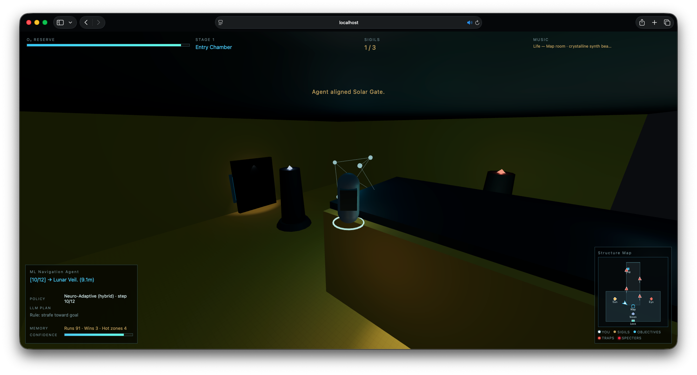
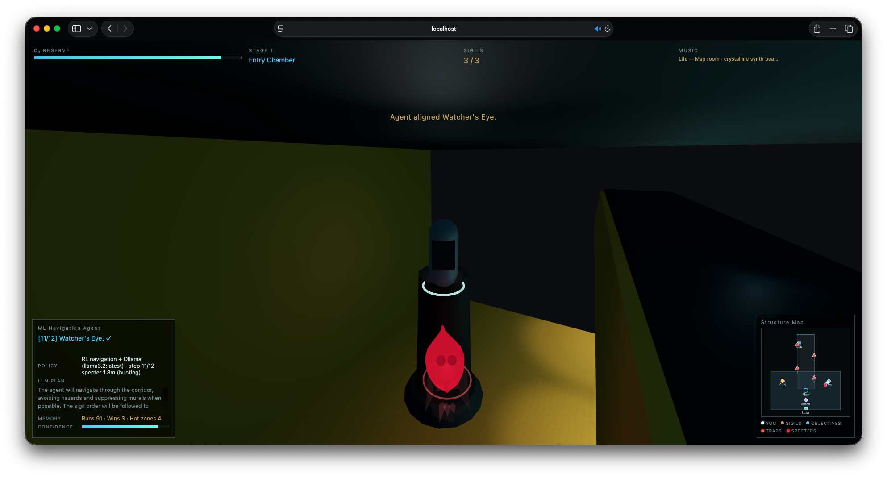
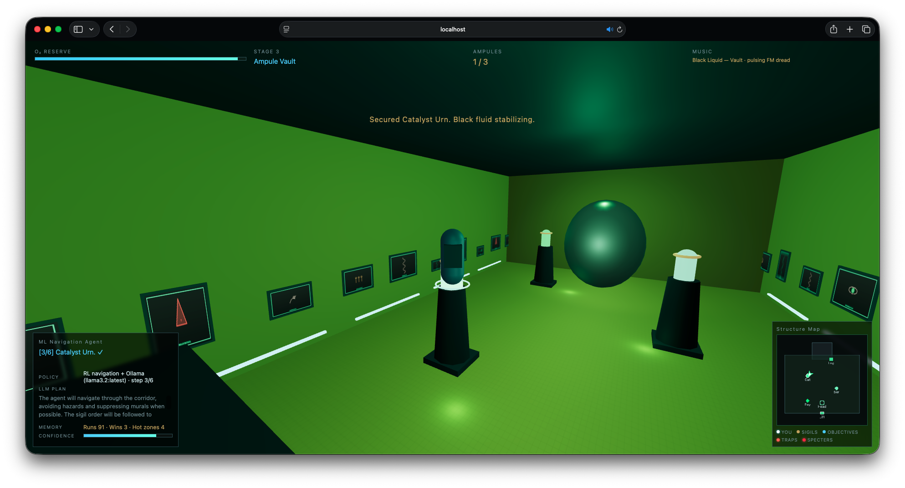
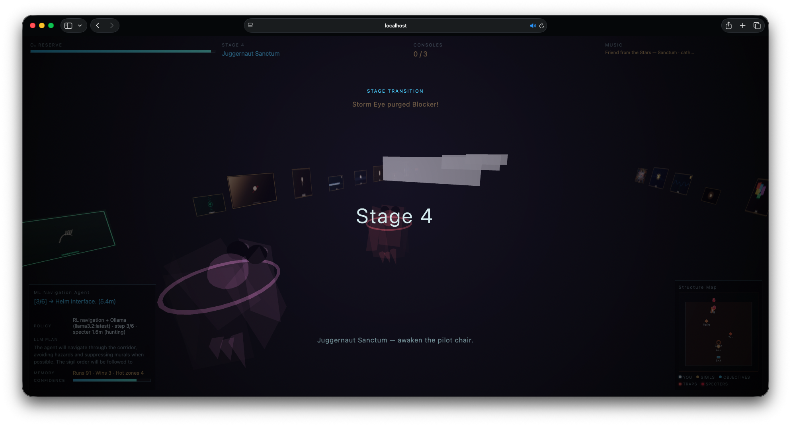
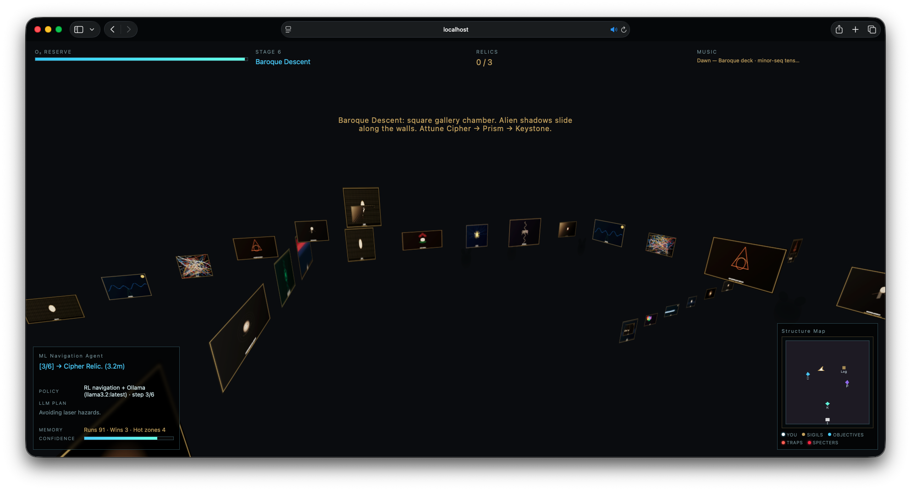

# Echoes of the Architects

A 3D exploration prototype with an autonomous agent that combines **A* pathfinding**, **survival rules**, **action search**, **persistent memory**, and **local Ollama LLM** planning.

## Screenshots

| Stage 1 — Entry Chamber | Stage 1 — Sigils complete |
|:---:|:---:|
|  |  |
| ML agent aligns sigils in the mustard chamber | All three sigils lit; hybrid RL + Ollama navigation |

| Stage 3 — Ampule Vault | Stage 4 — Juggernaut Sanctum |
|:---:|:---:|
|  |  |
| Secure Catalyst → Serum → Payload urns | Pilot chair objectives; alpha-pack pursuers |

| Stage 6 — Baroque Descent (gallery) |
|:---:|
|  |
| Artist murals, alien wall shadows, Cipher → Prism → Keystone relics |

## Play (with Ollama)

**Terminal 1:**
```bash
ollama serve
```

**Terminal 2:**
```bash
cd /Users/admin/Projects/echoes-architects
./scripts/run-game.sh
```

Open [http://localhost:8080](http://localhost:8080)

## Intelligence stack

| Layer | Purpose |
|-------|---------|
| **A* pathfinding** | Grid route that avoids hazard beam cones |
| **Survival rules** | Mandatory suppress / retreat / hold when traps threaten |
| **Action search** | Scores forward / strafe / wait — picks safest step |
| **localStorage memory** | Deaths, near-misses, wins per mural across sessions |
| **Ollama LLM** | Run-start plan + reactive replan every ~8s |
| **Auto-retry** | Redeploys with new plan until full extraction |

## Stages

1. **Entry Chamber** — Align Sun → Moon → Eye sigils, open the airlock.
2. **Architect's Bridge** — Cross the void bridge, tune Echo → Signal → Anchor beacons.
3. **Ampule Vault** — Secure Catalyst → Serum → Payload urns beneath the Engineer head.
4. **Juggernaut Sanctum** — Activate Helm → Drive → Ascent, launch the cryo escape pod.

## Ollama models

Recommended: **llama3.2:latest**. Also in UI: gemma, qwen3:8b, deepseek-r1, gpt-oss:20b.

## Architecture

```text
Browser → proxy :3001 → Ollama :11434
         ↓
    navigator.js (A* + survival + search)
         ↓
    hazard-murals.js (beams, suppress)
```

## Goal

Agent auto-navigates: corridor → terminal → chamber → sigils **Sun → Moon → Eye** → airlock.

## Stack

Three.js, Node Ollama proxy, Python static server

## Designer

Dang Hoang, AI Engineer
